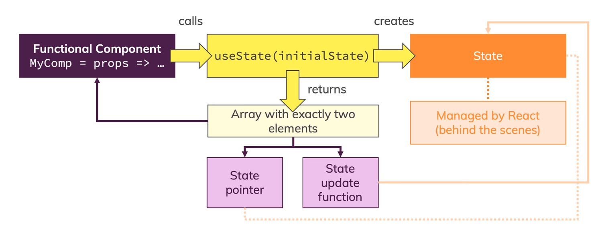

## React Hooks
- React hooks are special functions that can only be used in functional component (and custom hooks).
- These functions add extra capabilities to functional components

## Functional Components
- Historically limited to outputting content.
- Were not able to change internal state.

## Class Based Components
- Could contain and manage state.
- More overhead code(compared to functional component)

## Understanding useState
- Only use hooks on the root level not in some function or block of code

## Understanding useEffect
- Dependancy of [] , useEffect() acts like componentDidMount, It runs only once (after the first render)
